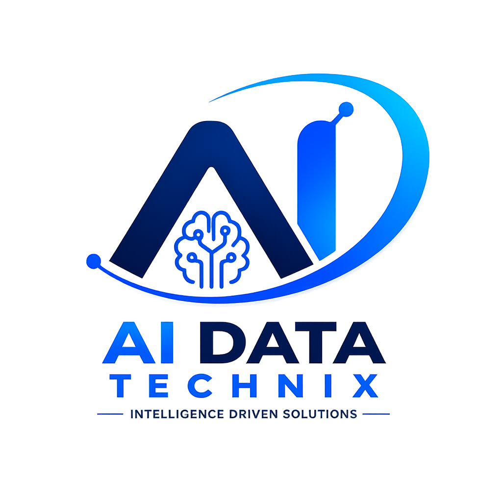

<div align="center">


# 🧠 AI DATA TECHNIX

### Building Intelligent Software. Powering Digital Innovation.

**AI • Software Development • Automation • Data Solutions**

[](mailto:aidatatechnix@gmail.com)
[](tel:+918574783464)
[](#)

</div>

---

## 🚀 About Us

**AI Data Technix** is a technology-focused software company dedicated to building intelligent digital solutions for modern businesses.

We combine **software engineering**, **artificial intelligence**, **automation**, and **data technologies** to help businesses simplify complex processes, improve efficiency, and embrace digital transformation.

> *Our mission is to empower businesses through intelligent, practical and scalable technology.*

| 🎯 Intelligent | 📈 Scalable | ✅ Practical |
|---|---|---|
| Solutions designed to make business processes smarter | Built with growth, flexibility and maintainability in mind | Focused on solving real business challenges with measurable value |

---

## 🛠️ What We Do

- 🧠 **AI & Machine Learning** — AI-powered applications, intelligent data processing, OCR and computer vision
- 💻 **Custom Software** — Business applications designed around specific workflows
- 🌐 **Web Applications** — Modern, responsive and scalable web-based apps
- 🔁 **Business Automation** — Automating repetitive processes to boost productivity
- 🗄️ **Data Solutions** — Data extraction, processing, management and analytics
- 🔗 **API & System Integration** — REST APIs connecting applications and business systems

---

## 🧩 Solutions We Build

- **Intelligent Business Systems** — Management Systems, Dashboards, CRM, HR, Inventory, Reporting
- **AI-Powered Solutions** — OCR, Computer Vision, Document Processing, Data Extraction
- **Process Automation** — Turning manual workflows into efficient digital processes
- **Custom Digital Solutions** — Built specifically around your business requirements

*Technology designed around your business, not the other way around.*

---

## ⚙️ Our Process

```
Idea  →  Architecture  →  Development  →  Testing  →  Deployment  →  Improvement
```

**01 Discover** → Understand the problem, users & requirements
**02 Design** → Define architecture, workflows & UX
**03 Develop** → Build reliable software using modern practices
**04 Deploy & Improve** → Deploy, maintain & continuously improve

---

## 🧑‍💻 Technology We Work With

<div align="center">

**Programming**


**Backend**


**Frontend**


**Database**


**AI / ML / Computer Vision**


**Tools**


</div>

---

## ⭐ Why Work With Us

| | |
|---|---|
| 🎯 **Business-First Approach** | We understand the problem before selecting the technology |
| 🧠 **AI + Software Engineering** | Intelligent technologies combined with reliable engineering |
| 🧩 **Custom Solutions** | Designed around your business, not generic workflows |
| 📈 **Scalable Architecture** | Built with future growth and integration in mind |
| 🔍 **Transparent Development** | Clear communication throughout the process |
| 🤝 **Long-Term Partner** | We build relationships, not just deliver software |

---

## 📌 Featured Projects

<!-- Pin your best repos below, or let GitHub's pinned repos widget show automatically under this README -->

---

<div align="center">



### 💬 Let's Build Something Intelligent

Have a business problem, idea or manual process you want to transform?

📧 **aidatatechnix@gmail.com** &nbsp;|&nbsp; 📞 **+91 85747 83464** &nbsp;|&nbsp; 🔗 **LinkedIn**

**Founder & CEO — Aman Modanwal**

*Building Intelligent Software. Powering Digital Innovation.*

</div>
