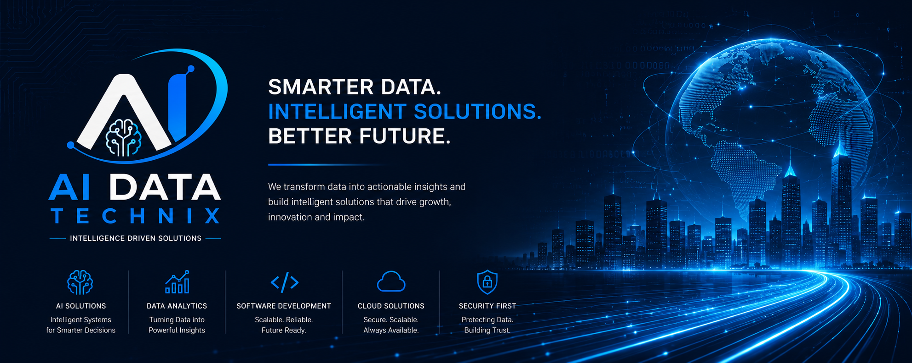

<p align="center">
  
</p>

<p align="center">
  
</p>

<p align="center">
  <a href="mailto:aidatatechnix@gmail.com"></a>
  <a href="tel:+918574783464"></a>
  <a href="#"></a>
</p>

<p align="center">
  
</p>

---

## 🚀 About Us

**AI Data Technix** is a technology-focused software company dedicated to building intelligent digital solutions for modern businesses.

We combine software engineering, artificial intelligence, automation and data technologies to help businesses simplify complex processes, improve efficiency and embrace digital transformation.

> Our mission is to empower businesses through **intelligent, practical and scalable technology.**

| 🎯 Intelligent | 📈 Scalable | ✅ Practical |
|---|---|---|
| Solutions designed to make business processes smarter | Built with growth, flexibility and maintainability in mind | Focused on solving real business challenges with measurable value |

---

## 🛠️ What We Do

- 🧠 **AI & Machine Learning** — AI-powered applications, intelligent data processing, OCR and computer vision
- 💻 **Custom Software** — Business applications designed around specific workflows
- 🌐 **Web Applications** — Modern, responsive and scalable web-based apps
- 🔁 **Business Automation** — Automating repetitive processes to boost productivity
- 🗄️ **Data Solutions** — Data extraction, processing, management and analytics
- 🔗 **API & System Integration** — REST APIs connecting applications and business systems

---

## 🧩 Solutions We Build

- **Intelligent Business Systems** — Management Systems, Dashboards, CRM, HR, Inventory, Reporting
- **AI-Powered Solutions** — OCR, Computer Vision, Document Processing, Data Extraction
- **Process Automation** — Turning manual workflows into efficient digital processes
- **Custom Digital Solutions** — Built specifically around your business requirements

*Technology designed around your business, not the other way around.*

---

## 🧑‍💻 Technology We Work With

**☕ Backend & Programming**
<p align="left"></p>
Java • Spring Boot • Python • Django • Flask • JavaScript • SQL • REST APIs

**🌐 Frontend**
<p align="left"></p>
HTML5 • CSS3 • React.js • Bootstrap

**🤖 AI / ML / Computer Vision**
<p align="left"></p>
OpenCV • YOLO • OCR • TensorFlow • Computer Vision • Document Intelligence

**🗄️ Database**
<p align="left"></p>
MySQL • Data Modeling • Structured Storage

**🔧 Tools & Platforms**
<p align="left"></p>
Git • GitHub • VS Code • Eclipse • Postman • Maven

---

## ⚙️ Our Process

`Idea` → `Architecture` → `Development` → `Testing` → `Deployment` → `Improvement`

<table align="center">
<tr><th>01 — Discover</th><th>02 — Design</th><th>03 — Develop</th><th>04 — Deploy & Improve</th></tr>
<tr>
<td>Understand the business problem, users and requirements</td>
<td>Define architecture, workflows and user experience</td>
<td>Build reliable software using modern development practices</td>
<td>Deploy, maintain and continuously improve the solution</td>
</tr>
</table>

---

## 🔌 System Overview

```json
{
  "organization": "AI Data Technix",
  "type": "AI-driven software solutions",
  "status": "actively building",
  "core_stack": ["AI/ML", "Computer Vision", "Automation", "Full-Stack", "Data Engineering"],
  "mission": "Turning data into intelligent action",
  "collaboration": "open"
}
```


---

## ⭐ Why Work With Us

| | |
|---|---|
| 🎯 **Business-First Approach** | We understand the problem before selecting the technology |
| 🧠 **AI + Software Engineering** | Intelligent technologies combined with reliable engineering |
| 🧩 **Custom Solutions** | Designed around your business, not generic workflows |
| 📈 **Scalable Architecture** | Built with future growth and integration in mind |
| 🔍 **Transparent Development** | Clear communication throughout the process |
| 🤝 **Long-Term Partner** | We build relationships, not just deliver software |

---

## 📌 Featured Projects

<!-- Pin your best repos in org settings — they'll display automatically below this README -->

---

<p align="center">
  
</p>

<h3 align="center">💬 Let's Build Something Intelligent</h3>

<p align="center">Have a business problem, idea or manual process you want to transform? Let's explore how AI, software and automation can create a smarter solution for your business.</p>

<p align="center">
  📧 <b>aidatatechnix@gmail.com</b> &nbsp;|&nbsp; 📞 <b>+91 85747 83464</b> &nbsp;|&nbsp; 🔗 <b>LinkedIn</b>
</p>

<p align="center"><b>Founder & CEO — Aman Modanwal</b></p>

<p align="center">
  
</p>

<h4 align="center">Building Intelligent Software. Powering Digital Innovation. 🚀</h4>
